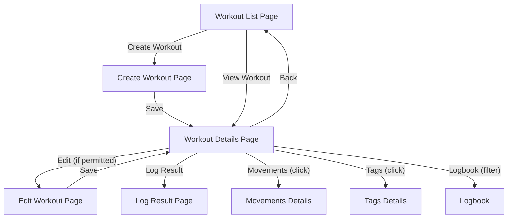

## Appetite

2 weeks

## Problem

Athletes and coaches need a fast, reliable way to create, view, and edit CrossFit-style workouts. Existing solutions are either too rigid, too slow, or too cluttered. We want spicy wod to make workout management as simple and explicit as possible, with a UI that's bold, readable, and never gets in the way.

## Solution

Build a brutalist, grid-based interface for creating, viewing, and editing workouts. The workflow should be obvious: create a new workout, see all its details, and edit anything as needed. All fields (name, description, scheme, movements, tags, etc.) are always visible and editable. The UI should be fast, minimal, and responsive.

## Rabbit Holes

- Complex validation for workout schemes (e.g., EMOM, AMRAP, etc.)
- Handling associations with movements and tags
- Ensuring edits don't break existing logged results
- Permission checks (only allow editing by workout creator or admin)
- Handling mobile layouts and touch interactions

## No-Gos

- No WYSIWYG or rich text editors—keep it plain and explicit
- No nested modals or popups
- No auto-saving drafts (explicit save only)
- No support for bulk editing or batch operations in this cycle

## Risks

- Schema complexity: Supporting all CrossFit workout types without making the UI confusing
- Data integrity: Editing a workout shouldn't break past results or associations
- Performance: Must remain fast even with many workouts and associations

## Scope

- **Create Workout**: Form with all required fields, validation, and association pickers for movements and tags.
- **View Workout**: Readable, grid-based display of all workout details, including associated movements, tags, and a log of past results.
- **Edit Workout**: Edit any field, update associations, and save changes.
- **Navigation**: Easy access from workout list to create/view/edit screens.
- **Permissions**: Only allow editing by the workout's creator or admin.

Breadboard: Create/View/Edit Workouts

1. Entry Points
   Workout List Page
   [Create Workout] button (top right)
   [Workout Name] (click to view details)
2. Create Workout Flow
   Create Workout Page
   Form fields:
   Name (text)
   Description (textarea)
   Scheme (select: time, reps, rounds-reps, etc.)
   Movements (multi-select)
   Tags (multi-select or add new)
   [Save] button (primary)
   [Cancel] button (secondary)
   Validation errors shown inline
   On save: redirect to Workout Details
3. View Workout Flow
   Workout Details Page
   Header: Workout Name, Edit button (if permitted)
   Sections:
   Description
   Scheme
   Movements (list, clickable to movement details)
   Tags (list)
   Logbook (table of past results, filterable)
   [Log Result] button
   Navigation: Back to Workout List
4. Edit Workout Flow
   Edit Workout Page
   Same form as Create, pre-filled with current values
   [Save] and [Cancel] buttons
   On save: redirect to Workout Details
5. Permissions
   Edit button only visible to workout creator or admin
   Save/Edit actions only allowed if permitted
6. Error States
   If workout not found: show "Not Found" message
   If permission denied: show "Not Allowed" message
7. Mobile
   All forms and lists are single-column, touch-friendly
   Buttons large and easy to tap

---

**Legend:**

- Rectangles = pages/screens
- Arrows = navigation/actions
- Indented lines = sub-actions or sections within a page
