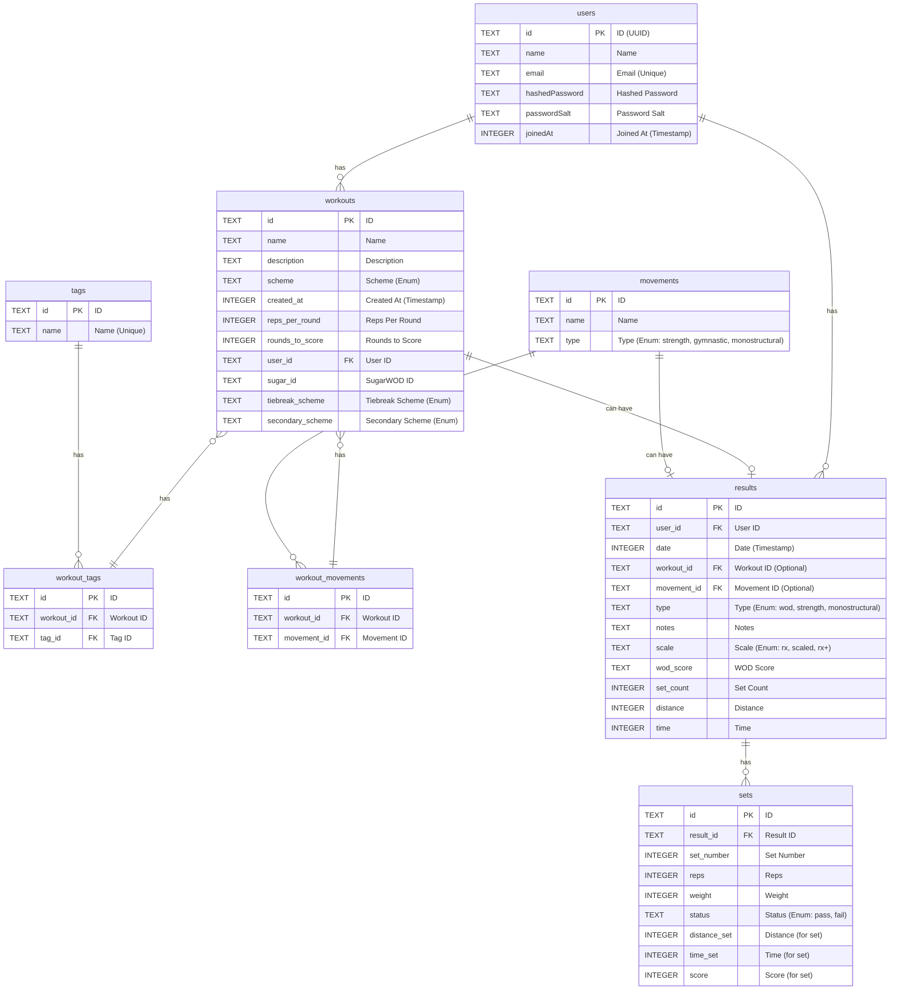

```mermaid
erDiagram
    users {
        TEXT id PK "ID (UUID)"
        TEXT name "Name"
        TEXT email "Email (Unique)"
        TEXT hashedPassword "Hashed Password"
        TEXT passwordSalt "Password Salt"
        INTEGER joinedAt "Joined At (Timestamp)"
    }

    movements {
        TEXT id PK "ID"
        TEXT name "Name"
        TEXT type "Type (Enum: strength, gymnastic, monostructural)"
    }

    tags {
        TEXT id PK "ID"
        TEXT name "Name (Unique)"
    }

    workout_tags {
        TEXT id PK "ID"
        TEXT workout_id FK "Workout ID"
        TEXT tag_id FK "Tag ID"
    }

    workouts {
        TEXT id PK "ID"
        TEXT name "Name"
        TEXT description "Description"
        TEXT scheme "Scheme (Enum)"
        INTEGER created_at "Created At (Timestamp)"
        INTEGER reps_per_round "Reps Per Round"
        INTEGER rounds_to_score "Rounds to Score"
        TEXT user_id FK "User ID"
        TEXT sugar_id "SugarWOD ID"
        TEXT tiebreak_scheme "Tiebreak Scheme (Enum)"
        TEXT secondary_scheme "Secondary Scheme (Enum)"
    }

    workout_movements {
        TEXT id PK "ID"
        TEXT workout_id FK "Workout ID"
        TEXT movement_id FK "Movement ID"
    }

    results {
        TEXT id PK "ID"
        TEXT user_id FK "User ID"
        INTEGER date "Date (Timestamp)"
        TEXT workout_id FK "Workout ID (Optional)"
        TEXT movement_id FK "Movement ID (Optional)"
        TEXT type "Type (Enum: wod, strength, monostructural)"
        TEXT notes "Notes"
        TEXT scale "Scale (Enum: rx, scaled, rx+)"
        TEXT wod_score "WOD Score"
        INTEGER set_count "Set Count"
        INTEGER distance "Distance"
        INTEGER time "Time"
    }

    sets {
        TEXT id PK "ID"
        TEXT result_id FK "Result ID"
        INTEGER set_number "Set Number"
        INTEGER reps "Reps"
        INTEGER weight "Weight"
        TEXT status "Status (Enum: pass, fail)"
        INTEGER distance_set "Distance (for set)"
        INTEGER time_set "Time (for set)"
        INTEGER score "Score (for set)"
    }

    users ||--o{ workouts : "has"
    users ||--o{ results : "has"
    workouts }o--|| workout_tags : "has"
    tags ||--o{ workout_tags : "has"
    workouts }o--|| workout_movements : "has"
    movements ||--o{ workout_movements : "has"
    workouts ||--o| results : "can have"
    movements ||--o| results : "can have"
    results ||--o{ sets : "has"
```
